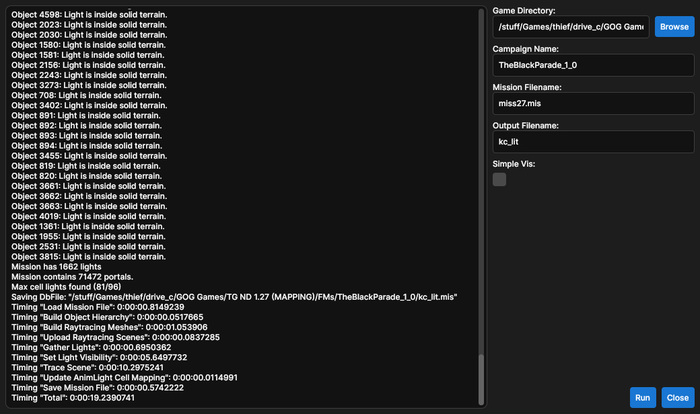

# KCLight

## Description

[TTLG Release Thread](https://www.ttlg.com/forums/showthread.php?t=152903)

KCLight is an external lightmapping tool for [NewDark 1.27](https://www.ttlg.com/forums/showthread.php?t=149856) fan mission. DromEd's built-in lighting is single-threaded, has a number of bugs, and scales extremely poorly with lightmap scale and large open spaces. KCLight uses a multi-threaded approach with a modern raytracing library to improve lighting times, reduce lighting artifacts, and often improves in-game performance in complex scenes.

## Features
- All DromEd lighting functionality
- Massively improved lighting times
- Better light culling, improving performance in large-scale city maps and eliminating object lighting errors
- Additional warnings to mappers for mis-configured lights
- Produces generally more accurate shadows

## Benchmarks

All tests were performed on a PC with a `Ryzen 5 2600` CPU. I've used a variety of mission sizes and types to help show what sort of missions benefit most from KCLight.

| Mission                           | DromEd   | KCLight  | Speedup |
|-----------------------------------|----------|----------|---------|
| Alcazar                           | 00:00:03 | 00:00:02 | ~1.5x   |
| Cinder Notes                      | 00:05:12 | 00:00:12 | ~26x    |
| Fierce Competition                | 00:00:08 | 00:00:01 | ~8x     |
| Godbreaker M2: Impious Pilgrimage | 00:07:21 | 00:00:03 | ~147x   |
| Into the Odd                      | 00:01:41 | 00:00:05 | ~20x    |
| Malazars Tower                    | 00:00:46 | 00:00:06 | ~7.5x   |
| TBP M8: Jaws of Darkness          | 00:08:23 | 00:00:18 | ~28x    |
| The Scarlet Cascabel M2           | 00:01:30 | 00:00:02 | ~45x    |
| TPOAIR M2: Collecting it All      | 01:00:58 | 00:00:27 | ~135x   |
| Winds of Misfortune               | 00:15:23 | 00:00:05 | ~185x   |

## Usage
Download the [latest release](https://github.com/JarrodDoyle/KeepersCompound.Lightmapper/releases/latest) and unzip it somewhere. KCLight comes with both a command line interface (`KCLight.exe`) and a GUI (`KCLight.Gui.exe`).

The GUI is simpler to use and is recommended if you don't have much experience using a terminal:


To use the CLI, open a console in the KCLight folder and run `KCLight --help` to see the help screen:
```
Compute lightmaps for a NewDark .MIS/.COW

Usage:
  KCLight <install-path> <campaign-name> <mission-name> 
  [options]

Arguments:
  <install-path>   The path to the root Thief installation. [required]
  <campaign-name>  The folder name of the fan mission. For OMs this is blank. 
                   [required]
  <mission-name>   The name of the mission file including extension. [required]

Options:
  -f, --fast-pvs     Use a fast PVS calculation with looser cell light indices. 
                     [default: False]
  -o, --output-name  Name of output file excluding extension. [default: kc_lit]
  -?, -h, --help     Show help and usage information
  -v, --version      Show version information
```

## Building

This project requires the [.NET 9.0 runtime and SDK](https://dotnet.microsoft.com/en-us/download/dotnet/9.0). Raytracing uses a forked version of [TinyEmbree](https://github.com/pgrit/TinyEmbree) with backface culling enabled, a pre-built package can be found in `LocalPackages`.

## License

Distributed under the MIT License. See `LICENSE` for more information.